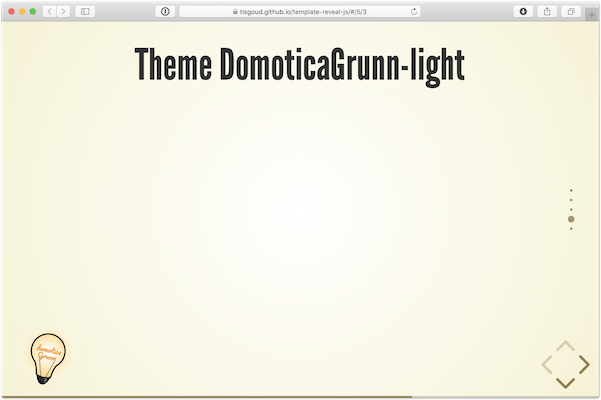
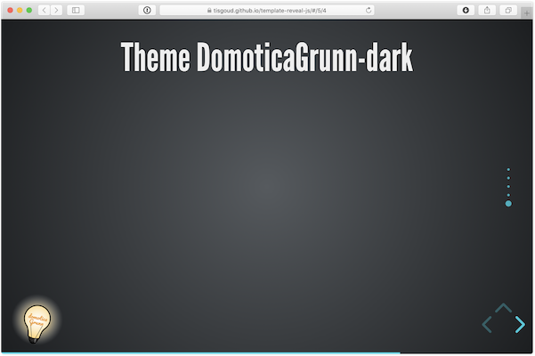

# Remote Access

Presentatie gegeven tijdens de domoticaGRunn Meetup van 27 maart 2024 bij de [Maakplek](https://maakplek.nl) in Groningen.

Voor deze presentatie is [Reveal.js](https://revealjs.com/installation/) gebruikt met de menu- en verticator plugin en een "custom theme".

## Features

- [Menu plugin](https://github.com/denehyg/reveal.js-menu)
- [Vertical slides indicator](https://github.com/Martinomagnifico/reveal.js-verticator) (plugin)
- Slides in separate Markdown file
- Themes with logos
  - domoticaGrunn, light and dark
- Title needs to be set in 'index.html'

## Menu files

- menu-info.html:
  - titel,
  - when and where,
  - author and
  - links to the applications used
- menu-links.html:
  - links to the subjects from the presentation
- menu is activated with 'm'
- on-the-fly swapping themes

## Vertical slide indicator

The vertical slide indicator plugin displays the number of vertical slides.

The color of the indicator needs to be set for each theme in the file 'index.html'.

## Slides in separate Markdown file

Slides are stored in 'slides.md'.

Images used in the slides are placed in the directory 'images'.

## Themes

Custom themes with logos for domoticaGrunn.

Images used in these themes are stored in the directory 'css>theme>images'.

Default theme is the domoticaGrunn-dark theme, this is set in 'index.html'.

### domoticaGrunn-light

dist/theme/domoticaGrunn-light.css

### domoticaGrunn-dark

dist/theme/domoticaGrunng-dark.css