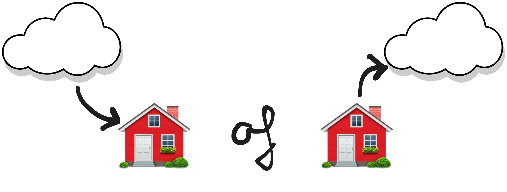

# Remote Access

---

## Remote Access ?

<!-- .slide: data-menu-title="Wat is het niet" data-background-image="img/et_phone_home.gif" data-background-opacity="0.6" -->

Note: Het "Mandela-effect" is het fenomeen waarbij we iets verkeerd onthouden en waarbij die fout zo hardnekkig is, dat ze zich als een nooit bestane herinnering in onze hersenen gaat nestelen. Drew Barrymore, wie heeft haar herkend? 1982: "E.T. home phone"

---

## Wikipedia

> Connection to a data-processing system from a remote location, for example, through a remote access service or virtual private network.

<!-- .slide: data-menu-title="Wikipedia" data-background-image="img/wikipedia.png" data-background-opacity="0.2" -->

---

## Hoe dan?

Remote Access kan globaal op twee manieren ...

Inkomende connectie, van buiten naar binnen

Uitgaande connectie, van binnen naar buiten

---

### Inkomende connectie

- Rechtstreeks naar je domotica systeem of
- VPN: Wireguard, OpenVPN, PPTP, L2TP/IPSec

&nbsp;&nbsp;

- Nadelen:
	- Firewall open poort naar het internet
	- Vast IP-adres? Zoniet via DDNS ([DuckDNS](https://www.duckdns.org/)).

--

### Advies
&nbsp;&nbsp;

Geen OpenVPN, poort open op internet

VPN o.b.v. Wireguard => UDP verbinding

&nbsp;&nbsp;

Eventueel in combinatie met een DDNS service.

---

### Uitgaande connectie
&nbsp;&nbsp;

- [Nabu Casa](https://www.nabucasa.com/) / [Home Assistant Cloud](https://www.nabucasa.com/)
- [Tailscale](https://tailscale.com/) / [Headscale](https://github.com/juanfont/headscale)
- [ZeroTier One](<[ZeroTier One](https://www.zerotier.com/)>)
- [Twingate](https://www.twingate.com/)

&nbsp;&nbsp;

- Requirements:
    - Afhankelijk van een "third party"

--

## Nabu Casa
&nbsp;&nbsp;

- Nabu Casa of Home Assistant Cloud
- Geintegreerde oplossing voor HA
- HA "sponsoring"

<!-- .slide: data-menu-title="Home Assistant" data-background-image="img/homeassistant.png" data-background-opacity="0.2" -->

--

## Tailscale
&nbsp;&nbsp;

- Gratis tot 100 clients
- P2P netwerk
- Wireguard-based

<!-- .slide: data-menu-title="Tailscale" data-background-image="img/tailscale-logo.png" data-background-opacity="0.2" -->

--

## Headscale
&nbsp;&nbsp;

- Self-hosted
- Open source
- Werkt met de Tailscale client
- P2P netwerk
- Wireguard-based

<!-- .slide: data-menu-title="Tailscale" data-background-image="img/tailscale-logo.png" data-background-opacity="0.2" -->

---

## Advies
&nbsp;&nbsp;

- Outside-in: Wireguard
- Inside-out: Nabu Casa of Tailscale

---

<!-- .slide: data-menu-title="That's all folks" data-background-image="img/Thats_all_Folks.jpg" data-background-opacity="1.0" -->
